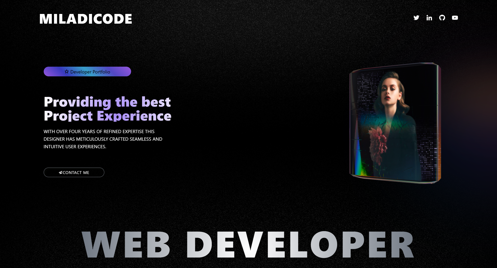

Welcome to this beginner-friendly tutorial where you'll learn how to create a fully responsive 3D portfolio website using ReactJS, TailwindCSS, and Spline 3D. Whether you're new to React or looking to enhance your frontend skills with modern web animation, this project is perfect for you.

---
## Introduction: 
#### 🚀 Build a Stunning 3D Portfolio Website Using ReactJS, TailwindCSS & Spline – Step-by-Step for Beginners!

#### Welcome to this beginner-friendly tutorial where you'll learn how to create a fully responsive 3D portfolio website using ReactJS, TailwindCSS, and Spline 3D. Whether you're new to React or looking to enhance your frontend skills with modern web animation, this project is perfect for you.

#### 🧩 What You’ll Learn

#### ✅ How to use Spline 3D in frontend
#### ✅ Building a React TailwindCSS project
#### ✅ Creating a smooth 3D portfolio experience
#### ✅ Implementing responsive layouts
#### ✅ Adding interactive animations and transitions🎨

#### This tutorial is perfect for beginners & advanced developers who want to build eye-catching, interactive websites.🎯

---
## Watch the full tutorial on YouTub
